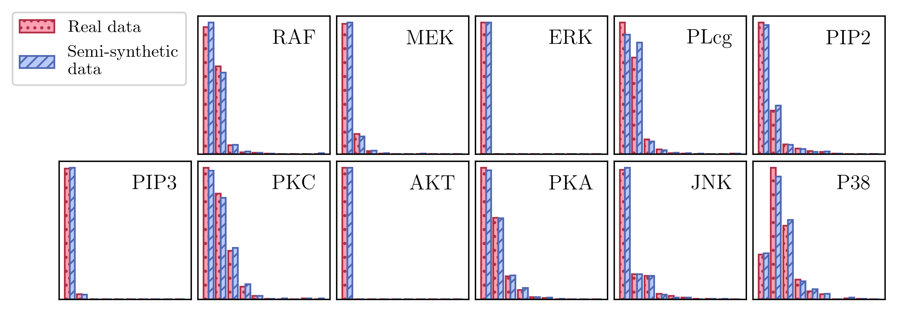

# Sempler: generate realistic semi-synthetic data for causal discovery with known ground truth



[Documentation at https://sempler.readthedocs.io/en/latest/]

Sempler allows you to generate generate semi-synthetic data with known causal ground truth but distributions closely resembling those of a real data set of choice. It is one of the software contributions of the paper [*"Characterization and Greedy Learning of Gaussian Structural Causal Models under Unknown Interventions"*](https://arxiv.org/abs/2211.14897) by Juan L. Gamella, Armeen Taeb, Christina Heinze-Deml and Peter Bühlmann. You can find more details in Appendix E of the paper.

If you find this code useful, please consider citing:

```
@article{gamella2022characterization,
  title={Characterization and Greedy Learning of Gaussian Structural Causal Models under Unknown Interventions},
  author={Gamella, Juan L. and Taeb, Armeen and Heinze-Deml, Christina and B\"uhlmann, Peter},
  year={2022}
}
```

## Overview

The semi-synthetic data generation procedure is implemented in the class `sempler.DRFSCM` (see [docs](https://sempler.readthedocs.io/en/latest/.)). A detailed explanation of the procedure can be found in Appendix E of the [paper](https://arxiv.org/abs/2211.14897).

Additionally, you can generate purely synthetic data from general additive-noise models. Two classes are defined for this purpose.

- `sempler.ANM` is for general (acyclic) additive noise SCMs. Any assignment function is possible, as are the distributions of the noise terms.
- `sempler.LGANM` is for linear Gaussian SCMs. While this is also possible with `sempler.ANM`, this class simplifies the interface and offers the additional functionality of sampling "in the population setting", i.e. by returning a symbolic gaussian distribution (see `sempler.LGANM.sample` and `sempler.NormalDistribution`).

To allow for random generation of SCMs and interventional distributions, the module `sempler.generators` contains functions to sample random DAGs and intervention targets.

### Installation
You can clone this repo or install using pip:
```
pip install sempler
```

Sempler is still at its infancy and its API is subject to change. Non backward-compatible changes to the API are reflected by a change to the minor or major version number,

> e.g. *code written using sempler==0.1.2 will run with sempler==0.1.3, but may not run with sempler==0.2.0.*

## Documentation

You can find the docs at https://sempler.readthedocs.io/en/latest/.
  
## Feedback

Feedback is most welcome! You can add an issue  or send an [email](mailto:juan.gamella@stat.math.ethz.ch>).
